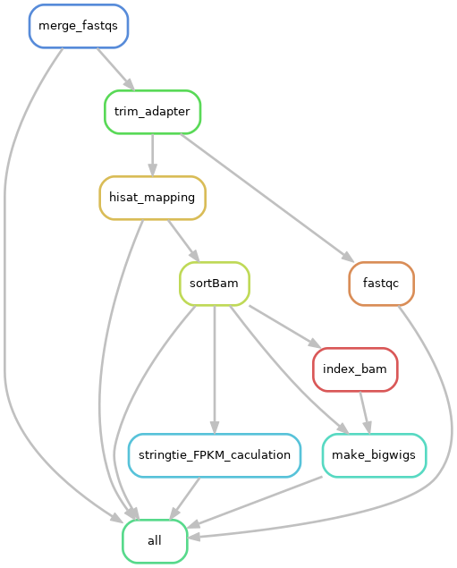

# snakemake_se_RNAseq

This pepeline is inspired by [crazyhottommy](https://github.com/crazyhottommy/pyflow-RNAseq).


generate workflow plot
```bash
snakemake --dag 2> /dev/null | dot -T png > workflow.png
```
the flow is as following



### dry run to test

```bash
## dry run
snakemake -np
```
if no errors, preceed below.
```bash
snakemake -j -np  99 --cluster '/Snakefile-sbatch.py'
```
